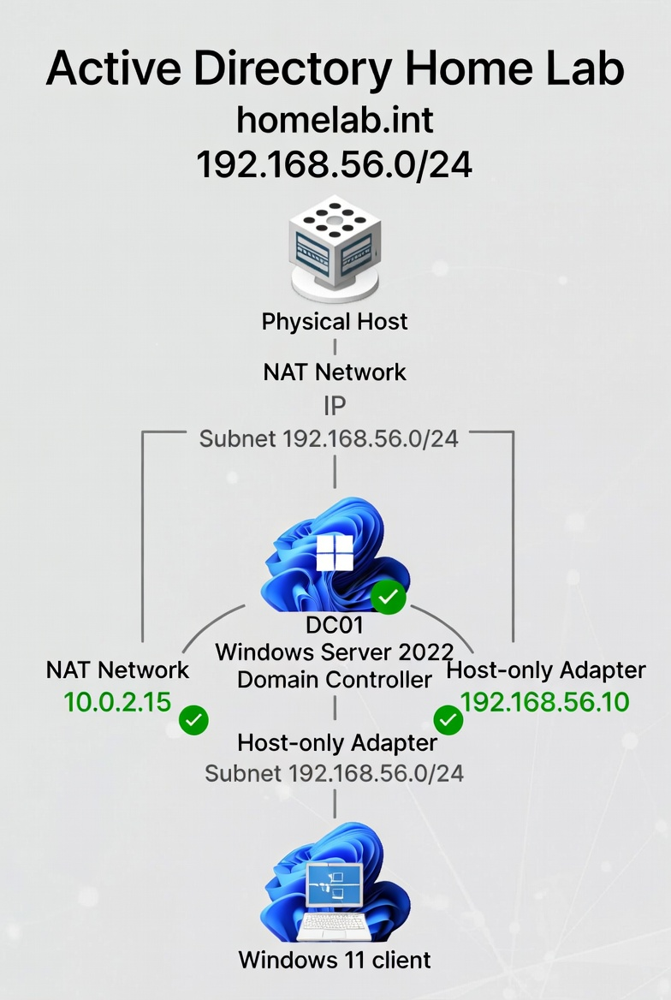

# Active Directory Home Lab – VirtualBox (Windows Server 2022 + Windows 11)

A complete, isolated Active Directory environment built in **Oracle VirtualBox** to simulate enterprise identity management, user provisioning, policy enforcement, file sharing, and basic PKI.

**Purpose**: Hands-on practice for IT support/helpdesk → junior sysadmin roles.  
Demonstrates: virtualization, networking, AD DS, DNS/DHCP, PowerShell automation, GPOs, NTFS/share permissions, AD CS auto-enrollment.

## 🏗️ Lab Overview

- **Hypervisor**: Oracle VirtualBox (latest)
- **Domain Controller**: Windows Server 2022 Standard (Evaluation)  
  → Dual NIC: NAT (internet) + Host-only (internal lab network 192.168.56.0/24)
- **Client**: Windows 11 Enterprise (Evaluation) – domain joined
- **Domain**: homelab.int
- **Features**:
  - AD DS + integrated DNS
  - DHCP server on DC
  - Routing/NAT via RRAS (clients have internet)
  - PowerShell automated user/group creation & onboarding
  - Secure file share with group-based NTFS & share permissions
  - Basic Enterprise Root CA with certificate auto-enrollment via GPO

## 📋 What You'll Find in This Repo

- [docs/](docs/) – Detailed step-by-step guides (beginner friendly)
- [scripts/](scripts/) – PowerShell automation examples
- [screenshots/](screenshots/) – Visual proof of every major step

## 🚀 Quick Start / Key Achievements

1. Dual-NIC DC with internet sharing to internal network  
2. Fully functional AD domain with DHCP & DNS  
3. Scripted user creation & group assignment  
4. Departmental file share with least-privilege access  
5. GPO-driven certificate auto-enrollment (PKI basics)

## 🛠️ Technologies & Skills Demonstrated

- Virtualization: VirtualBox networking (NAT + Host-only)
- Windows Server 2022: AD DS, DNS, DHCP, RRAS, AD CS
- PowerShell: User provisioning automation
- Identity & Access Management: OUs, groups, GPOs
- Security: NTFS/Share permissions, PKI basics

## 📸 Screenshots Highlights

| Step                        | Screenshot Link                                      |
|-----------------------------|------------------------------------------------------|
| Lab Network Architecture    | [overview-diagram.jpg](screenshots/overview-diagram.jpg) |
| DC Dual NIC Config          | [dc-network-adapters.png](screenshots/dc-network-adapters.png) |
| User Creation Script Run    | [user-creation-script-run.png](screenshots/user-creation-script-run.png) |
| File Share – Full Access    | [file-share-access-full.png](screenshots/file-share-access-full.png) |
| Certificate Auto-Enrollment | [certificate-autoenroll.png](screenshots/certificate-autoenroll.png) |
| DHCP Scope Configuration          | [dhcp-scope-config.png](screenshots/dhcp-scope-config.png)                      |
| GPO Auto-Enrollment Setting       | [gpo-editor-autoenroll.png](screenshots/gpo-editor-autoenroll.png)              |
| Client IP Configuration           | [ipconfig-on-client.png](screenshots/ipconfig-on-client.png)                    |
| Access Denied (ReadOnly User)     | [access-denied-readonly.png](screenshots/access-denied-readonly.png)            |
| Certification Authority Console   | [certsrv-console.png](screenshots/certsrv-console.png)                          |

## 📄 Full Documentation

→ Dive into the detailed guides in the [docs/](docs/) folder

## ⚠️ Important Notes

- This is a **lab only** – do **not** use in production
- All software used evaluation/trial versions
- Passwords are simple for lab purposes – change in real scenarios

## 📜 License

MIT License – feel free to use as inspiration for your own labs/portfolio.

---
Built with love for learning | Last updated: January 2026
